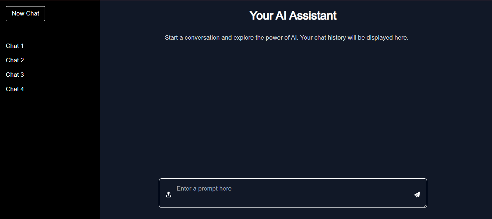
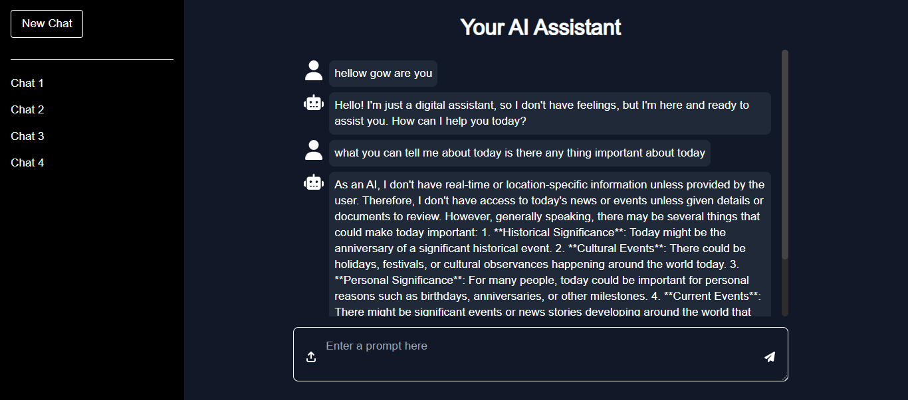

# OpenAI Express Server Integration

This project is an Express.js server integrated with OpenAI's API. It includes features such as file uploading, creating and managing an OpenAI assistant, and handling chat interactions using the assistant.





## Introduction

The server is designed to interact with OpenAI's API, providing an interface for chat functionalities and file management. It uses `multer` for handling file uploads, `body-parser` and `cors` for middleware support, and `dotenv` for environment variable management.

## Installation

To get started with this project, follow these steps:

1. Clone the repository:

   ```
   git clone https://github.com/RaheesAhmed/OpenAI-Assistant-API-with-UI.git
   ```

2. Install dependencies:

   ```
   npm install
   ```

   if npm install is not working try to install pacakes:

   ```
   npm install --save @fortawesome/fontawesome-svg-core @fortawesome/free-solid-svg-icons @fortawesome/react-fontawesome
   ```

Create a `.env` file in the root directory and add your OpenAI API key:
` OPENAI_API_KEY=your_api_key_here`

3. Starting the Server
   Run the server using the following command:

   ```
   npm start
   ```

   This will start the server on the default port 3000 or on a port specified in the .env file.

# API Endpoints

`POST /chat`

Description: Sends a chat question to the OpenAI assistant and returns its response.
Payload: `{ "question": "Your question here" }`
`POST /upload`

Description: Uploads a file to be used with the OpenAI assistant.
Form-data: file: [Your File Here]

## Contributing

Contributions to this project are welcome. Please ensure to follow the existing code style and add unit tests for any new or changed functionality
